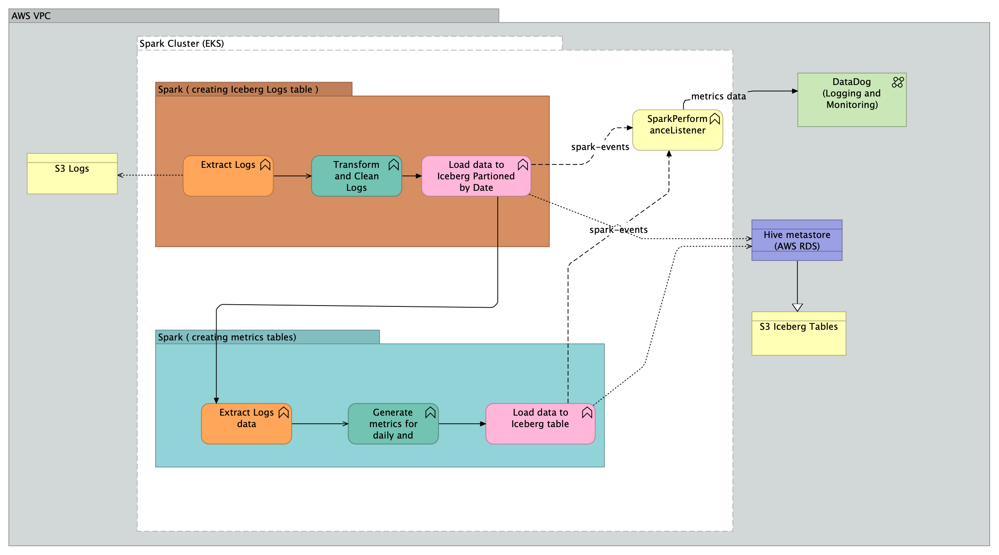

# Spark Iceberg Log Analytics Application

A Spark-based application to demonstrate real-time query performance monitoring using Datadog’s DogStatsD client.

## High level architecture



## Features

* ETL
1. Extracting data from Log S3 log files
2. Cleaning and transforming it
3. Creating Iceberg table partitioned by date
4. Generating metrics table or daily and weekly Ips and Devices data.

* Datadog Monitoring - Real-time monitoring of query execution metrics, including:

1. Query success count
2. Query execution time


link - https://p.us5.datadoghq.com/sb/81e1f30c-a4ad-11ef-a25a-2ad788a6efe0-740fa55ce4b644671fea2ef38c54a3c3
---

# **Scaling Numbers for LogIcebergIQ Application**

## **1. Metrics for Infrastructure Scalability**

### **a. Data Throughput**
- **Definition**: Number of log records processed per second.
- **Estimation**:
  - Assume raw log records are approximately **500 bytes** per entry (typical log size).
  - For a cluster with `n` executors, where each executor processes **x MB/sec**:
    - **Throughput per Executor**:
      - Spark I/O (HDFS, S3): ~50–200 MB/sec per executor, depending on disk and network.
    - **Estimated Throughput**:
      - For 5 executors and 100 MB/sec throughput per executor:
        ```plaintext
        5 executors × 100 MB/sec = 500 MB/sec
        ```
      - This translates to approximately:
        ```plaintext
        (500 MB/sec ÷ 0.5 KB) = 1,000,000 records/sec
        ```

### **b. Query Latency**
- Queries like "Top 5 IPs" or "Top 5 Devices":
  - For a 1 TB dataset partitioned by `date` in Iceberg:
    - Partition pruning significantly reduces query execution time (e.g., querying a single day’s data takes ~2–5 seconds).
    - Full table scans for weekly aggregations might take ~20–30 seconds on a well-configured Spark cluster.

### **c. Storage**
- Iceberg writes are optimized for **parquet file size (~128 MB)**:
  - For 1 TB of daily log data:
    - Assume ~10 million log entries/day.
    - Iceberg partitions and compaction ensure storage remains efficient:
      ```plaintext
      ~1 GB/hour = ~24 GB/day = ~720 GB/month
      ```

---

## **2. Scaling Numbers by Infrastructure**

### **a. Single Node Setup**
- **Throughput**: ~50–100 MB/sec (e.g., processing ~200,000 log records/sec).
- **Query Latency**:
  - Partitioned queries: ~5–10 seconds.
  - Full table scans: ~30–60 seconds (depends on dataset size).

### **b. Multi-Node Spark Cluster**
- **Example Setup**:
  - 5 nodes (r5.4xlarge on AWS: 16 vCPUs, 128 GB RAM).
  - **Throughput**: ~500–1,000 MB/sec.
  - **Query Latency**:
    - Partitioned queries: ~2–5 seconds.
    - Full scans: ~20–30 seconds.

### **c. S3 Bandwidth**
- **Data Input/Output**:
  - AWS S3 delivers **500–5,000 requests/sec per prefix**.
  - For Iceberg writes (append mode):
    - Compaction minimizes the number of small files written, sustaining ~100 MB/sec.

### **d. Scaling**
- Adding nodes linearly scales throughput (due to Spark’s parallelism and Iceberg’s metadata optimization).
- Example:
  - 10 nodes (100 MB/sec per executor): **~1 GB/sec throughput**.
  - **1 TB of logs** can be processed in ~16–20 minutes.

---

## **3. Estimate by Dataset Size**

| Dataset Size  | Executors | Estimated Throughput  | Query Latency (Top 5 IPs/Devices) |
|---------------|-----------|-----------------------|------------------------------------|
| 100 GB        | 5         | ~500 MB/sec          | ~5–10 seconds                     |
| 1 TB          | 10        | ~1 GB/sec            | ~20–30 seconds                    |
| 10 TB         | 50        | ~5 GB/sec            | ~2–3 minutes                      |
| 100 TB        | 100+      | ~10 GB/sec           | ~5–10 minutes                     |

---

## **4. Factors Affecting Scalability**

1. **Partitioning**:
   - Iceberg tables partitioned by `date` or `week` allow efficient pruning.
   - Without partitioning, query latency increases significantly due to full table scans.

2. **Concurrency**:
   - Spark scales well with concurrent queries due to its distributed nature.
   - Iceberg metadata caching reduces repeated table scan costs.

3. **Cluster Configuration**:
   - Executor memory and cores affect per-node throughput.
   - Increasing parallelism improves performance for large datasets.

4. **Network Bandwidth**:
   - For cloud setups (e.g., AWS EMR with S3), network bandwidth is a limiting factor (~500 MB/sec for S3).

---

## **5. Example Test Cases**

### **a. Throughput Test**
- **Goal**: Measure records processed per second.
- **Method**:
  - Generate 1 billion log records (~500 GB).
  - Process logs using Spark with a cluster of 10 executors.
  - Monitor throughput using Spark metrics (`spark.eventLog.enabled=true`).

### **b. Query Performance**
- **Goal**: Measure latency for “Top 5 IPs” query.
- **Method**:
  - Run a query on an Iceberg table partitioned by `date` with 1 TB of data.
  - Monitor execution time via the Spark UI or Datadog.

---

## **6. Infrastructure Recommendations**

### **Cluster Size**:
- Start with 5 nodes (e.g., r5.4xlarge on AWS) for medium-scale logs (~1 TB/day).
- Scale linearly by adding nodes for larger datasets.

### **Storage**:
- Use AWS S3 or HDFS for scalable storage.
- Iceberg handles metadata efficiently even for large datasets.

### **Monitoring**:
- Use Spark metrics for query performance.
- Integrate with Datadog or Prometheus for real-time monitoring.

---

## **7. Summary of Scaling Numbers**

- **Throughput**: ~1 GB/sec (10 nodes).
- **Log Processing**:
  - ~1 TB of logs processed in ~20 minutes.
- **Query Latency**:
  - Partitioned queries: ~2–5 seconds.
  - Weekly full scans: ~20–30 seconds for 1 TB.
- **Storage**:
  - ~1 TB of logs = ~30–40 GB after Iceberg compaction (depends on partitioning and schema).

 ---

# Running Spark Job

* you can submit this job using **spark-submit** or run directly in local environment by running **Main** 

```shell
spark-submit \
  --class in.pateash.sparkiceberglogiq.Main \  # Main class in your project
  --master local[*] \  # For local testing, change to 'yarn' or 'k8s' for cluster mode
  --deploy-mode client \  # Change to 'cluster' if running on a cluster
  --driver-memory 4g \  # Adjust memory for the driver
  --executor-memory 4g \  # Adjust memory per executor
  --executor-cores 2 \  # Number of cores per executor
  --num-executors 4 \  # Number of executors (useful in cluster mode)
  --jars /path/to/hadoop-aws-3.3.4.jar,/path/to/aws-java-sdk-bundle-1.12.520.jar,/path/to/iceberg-spark-runtime-3.5_2.12-1.5.0.jar \  # External dependencies
  /path/to/target/scala-2.12/sparkiceberglogiq_2.12-0.0.1.jar
```
